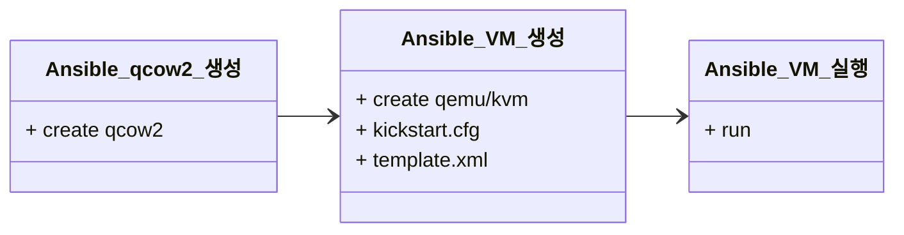

> [!NOTE] 작업의 기준
> VM 생성 + 운영 체제 초기화, 네트워크 설정 - Ansible
> 초기 소프트웨어 설치 - Ansible
> 상태 및 수행 관리 - Terraform

#### 수행 Flow

#### 1장. Ansible qcow2 생성
```
Ansible 환경 변수를 기준으로 qcow2 파일의 명명 및 디스크 사이즈가 정의되고,

Ansible playbook으로 디렉토리 권한 획득 후 qcow2 파일 생성을 수행합니다.
```

#### 2장. Ansible VM 생성
```
마찬가지로 Ansible 환경 변수가 적용됩니다. (vm에 사용할 각종 변수들)

Ansible playbook을 통해서 qcow2 파일 확인하고,

사전 정의 된 Kickstart.cfg , template.xml 파일을 세팅합니다.

*Ansible 환경 변수 기준으로 template 내용을 Generate 하여 vm에 셋업됩니다.
```

> [!TIP] Kickstart
> Rocky Linux에서 Kickstart를 통해서 운영 체제를 파일 기반으로 자동화 설치합니다.

> [!TIP] template.xml.j2
> Jinja2 문법으로 ( {{ 변수명}} )을 사용해 값을 동적으로 설정합니다.

ex)
```
(예시)
<vcpu>{{ vm_vcpu }}</vcpu>

(기대 적용)
<vcpu>2</vcpu>
```

#### 3장. Ansible VM 실행
```
Ansible 환경 변수가 적용되어 Ansible playbook으로 VM을 실행합니다.
```

___

Kickstart와 template.xml.j2 작성 예시 및 상세 내용은 **qemu-kvm** 목차에 작성.

